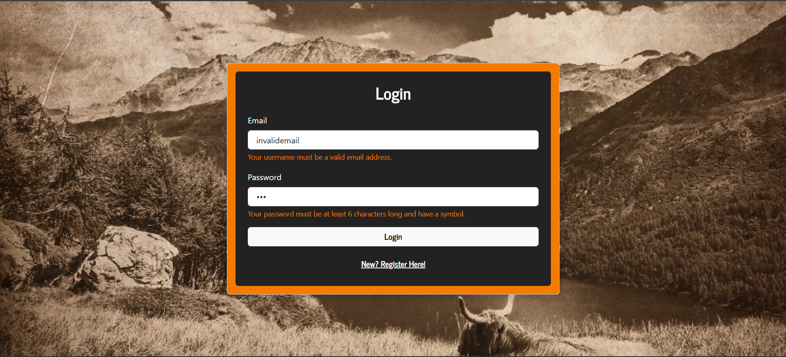
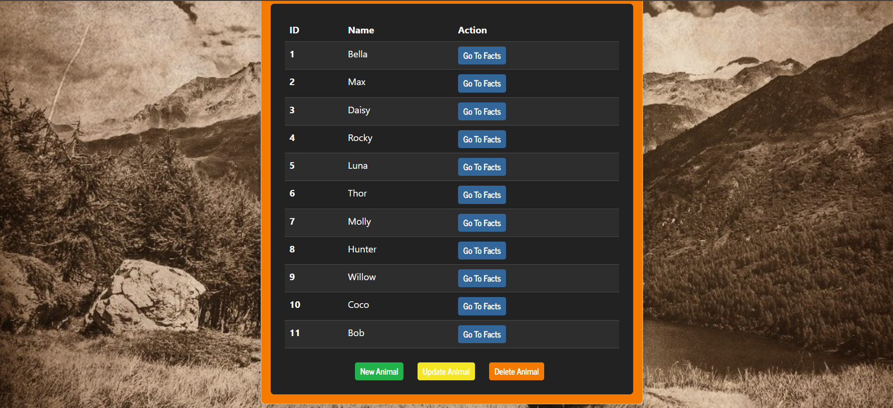
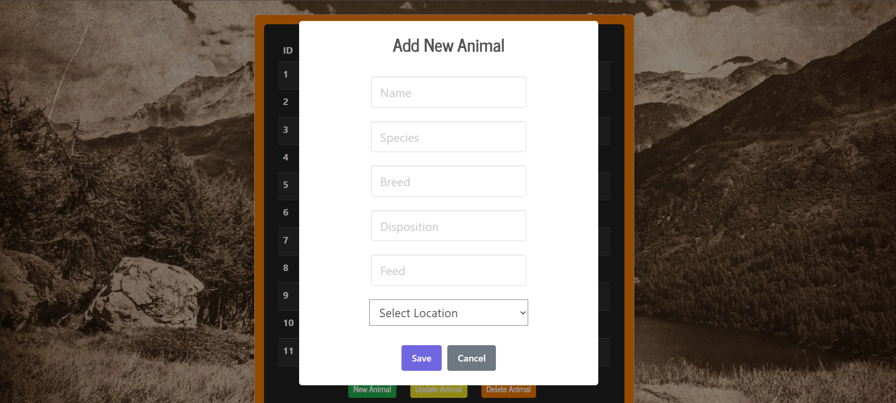
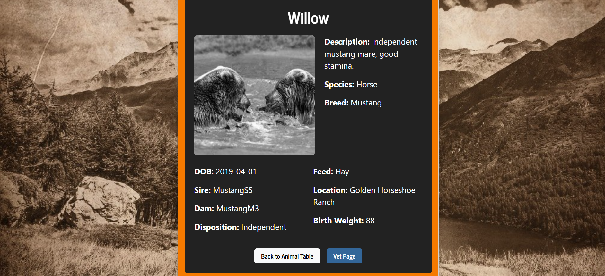

Test User 1 =
    email = testrancher@gmail.com
    password = Password1

 Canyon Crest Animal Tracker

Canyon Crest Animal Tracker is a ranch-themed web application designed to help ranch users manage and track their animals. The app provides a clean, intuitive interface for viewing, adding, updating, and deleting animals, as well as tracking recent veterinary visits and learning interesting facts about each animal.

🌾 Features

Animal Management

Add new animals to the database

Update existing animal records

Delete animals when no longer needed

View detailed facts about each animal

Review recent veterinary visits

User Accounts

Sign up and log in to see user-specific animals

⚠️ Note: No authentication or password protection implemented

Rustic, ranch-inspired UI design

Mobile-friendly layout for tablets and phones

🛠 Technologies Used

Frontend: HTML, CSS (Bootstrap), JavaScript

Backend: Node.js / Express 

Database: SQLite

Alerts & Notifications: SweetAlert2

💻 Screenshots

Replace the links below with actual screenshots of your app

Welcome / Login Page

Animal Table:

Add Animal Form:

Fact Page:

Mobile Responsiveness:

⚠️ Notes

All data is stored in a local SQLite database.

User accounts are tracked per session for demo purposes; there is no authentication.

Designed for ranch staff or enthusiasts to quickly manage animal data.
